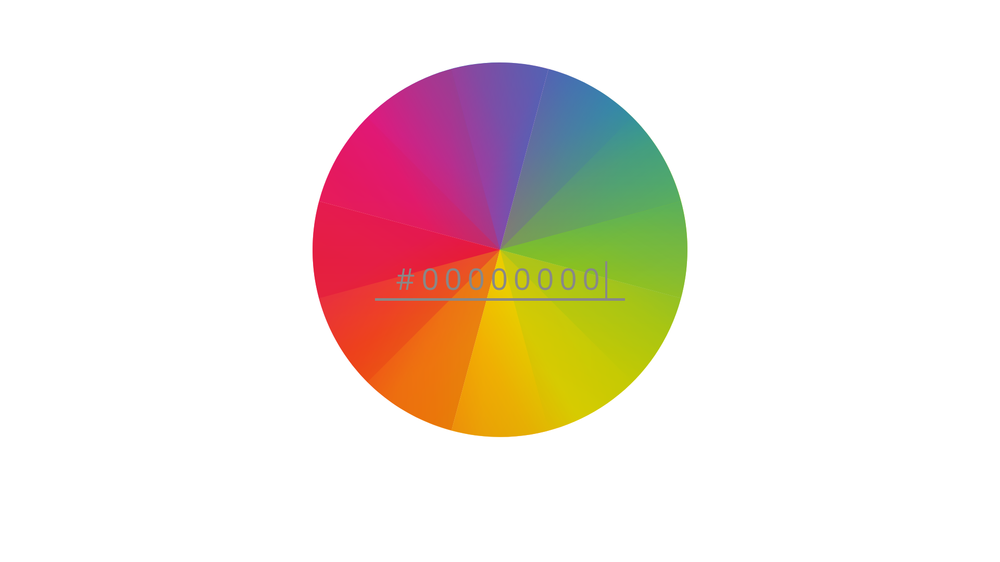

<h1 style="text-align:center;font-family:monospace;font-size:30px;font-weight:bold;">GetDaKolor</h1>

A simple website to visualize the color from its color-code

Some snapshots of the website

 
 
 
 

